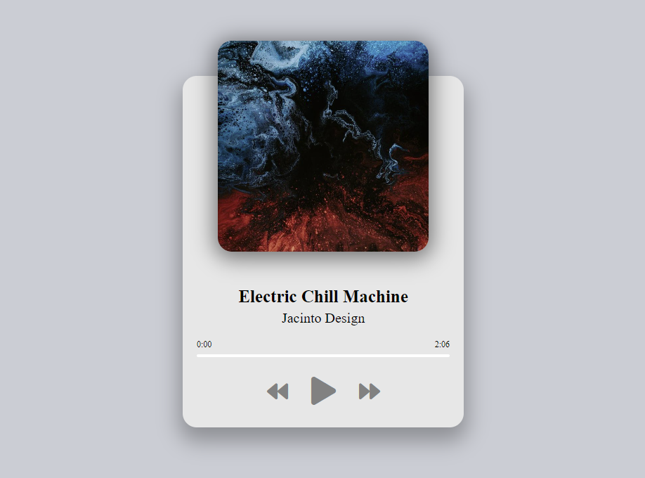

[music-player-link]: https://amssdias.github.io/music-player/

# Music Player

Welcome to the Simple Music Player! This lightweight, intuitive music player is designed to bring your favorite tunes to life with just a few clicks. Built with HTML, CSS, and JavaScript, it offers a sleek, user-friendly interface that lets you easily navigate through your music collection.

## Live Demo

Visit the [Music Player][music-player-link] and listen to some cool music.
